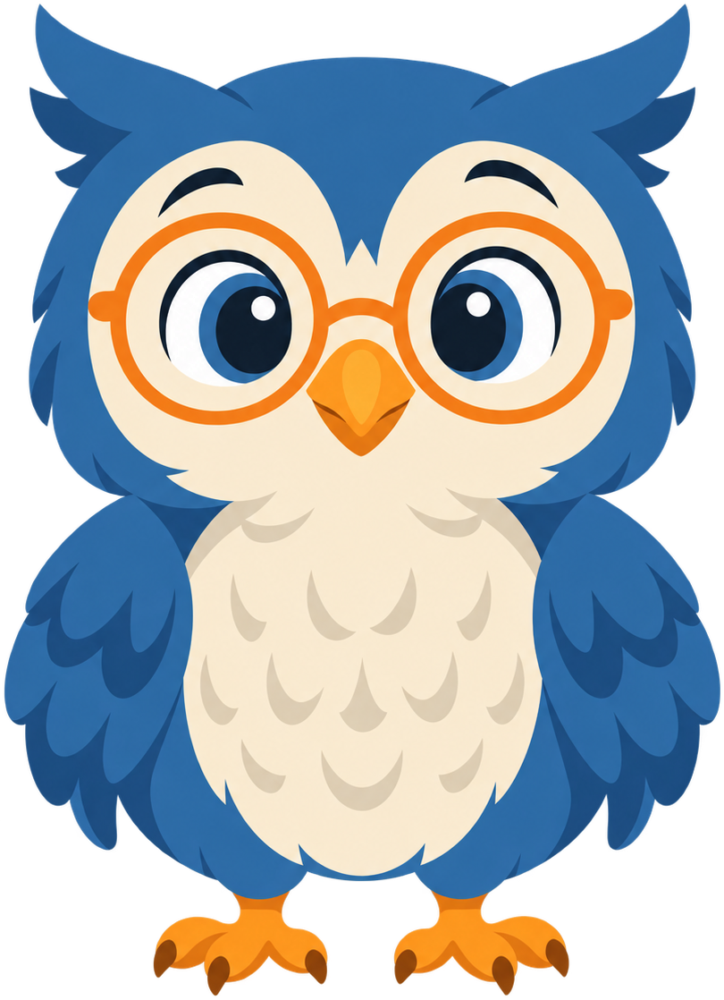
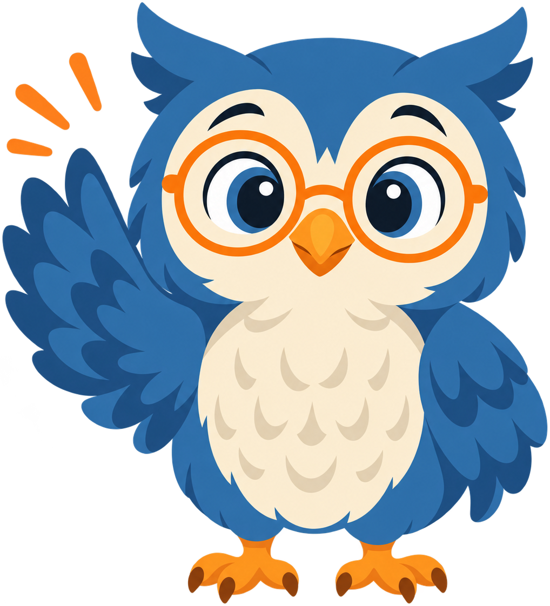
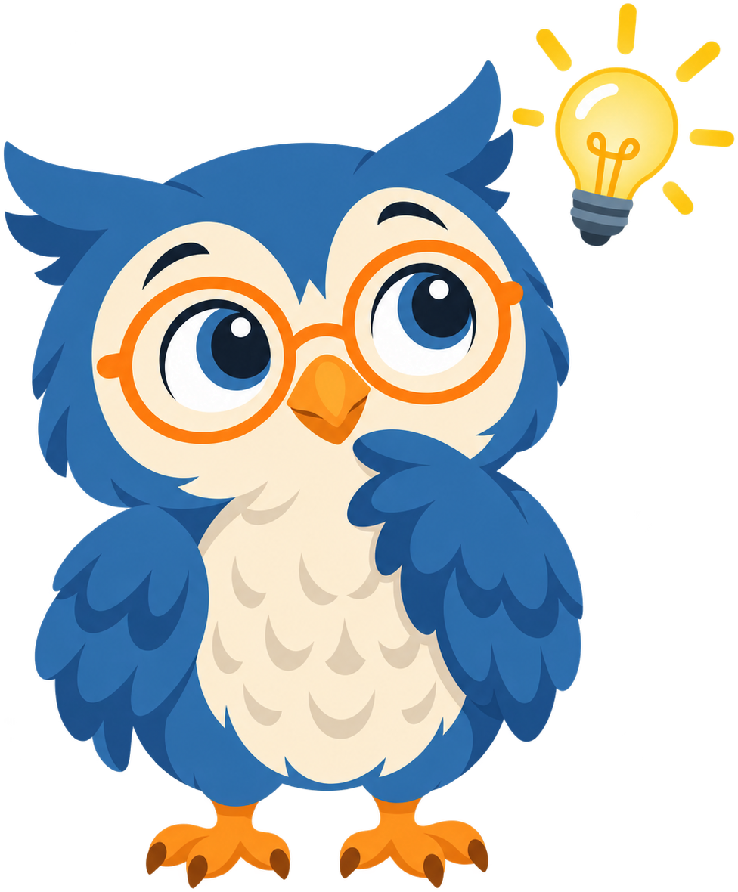
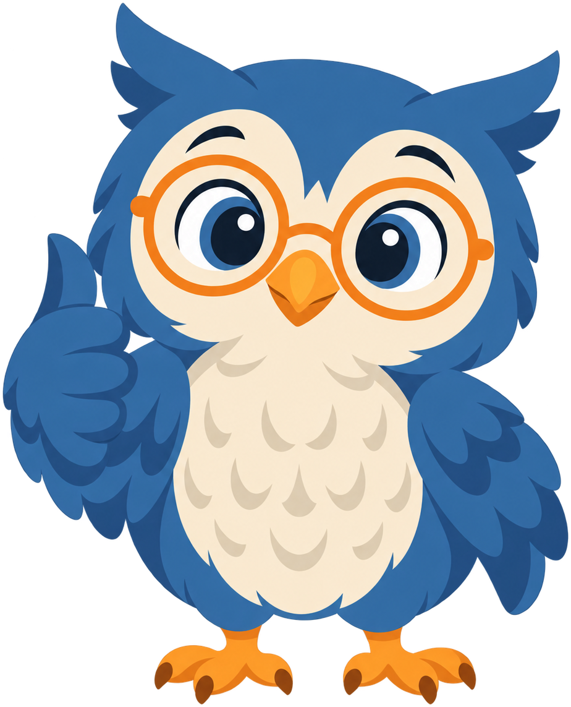
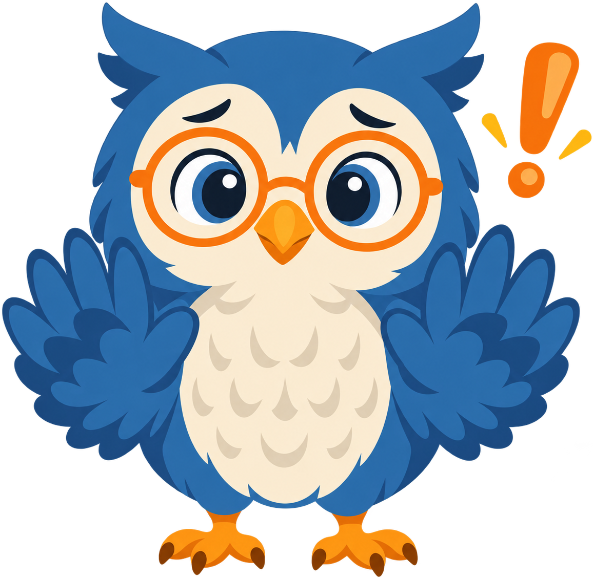
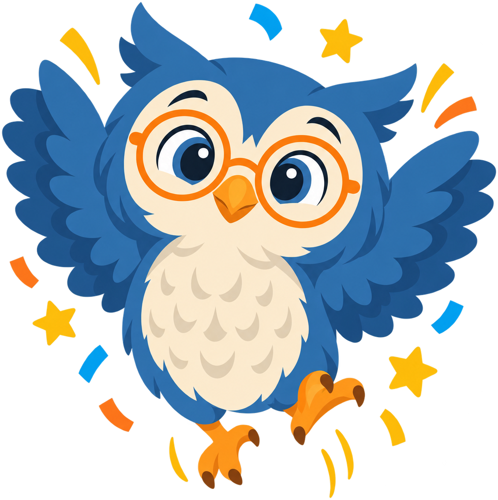

# Systems Thinking

**Sage the Owl** is the mascot for [Systems Thinking in the Age of AI](https://dmccreary.github.io/systems-thinking/), a textbook on systems thinking, knowledge graphs, and breaking down organizational silos. Owls can rotate their heads roughly 270 degrees and see across a nearly panoramic field of view, a working biological version of the "zoom out and see the whole system" habit of mind the course is built to teach — noticing the connections and feedback loops that a narrow, part-by-part view misses. The name Sage draws on the owl's long-standing role as a symbol of wisdom rather than on any pun specific to systems thinking, so it reinforces the character's tone without adding a second, discipline-specific layer of meaning. Sage was chosen to model the discipline's central move: stepping back from a single component to see how it fits into the larger structure around it, which is the habit systems thinking asks every reader to practice. That gives Sage solid subject-coupling — the owl's wide field of view is a genuine metaphor for a systems view, not just decoration — though the mascot lands in the gallery's "better" tier rather than its "best," since the name itself doesn't carry the extra discipline-specific meaning the strongest mascots' names do.

All poses for the **Systems Thinking** mascot.

-   { width=300 }

    **Neutral**

-   { width=300 }

    **Welcome**

-   { width=300 }

    **Tip**

-   { width=300 }

    **Thinking**

-   { width=300 }

    **Encouraging**

-   { width=300 }

    **Warning**

-   { width=300 }

    **Celebration**

[← Back to gallery](../../list-mascots.md)
