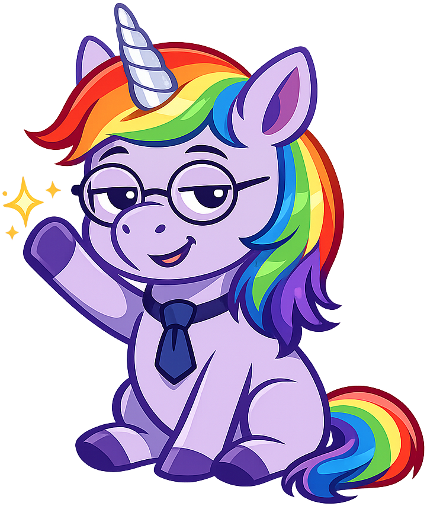
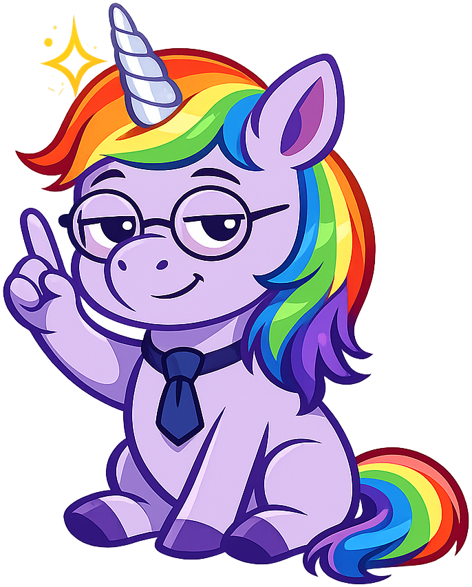
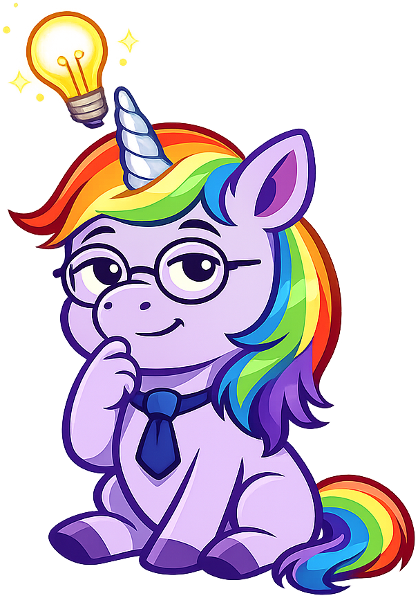
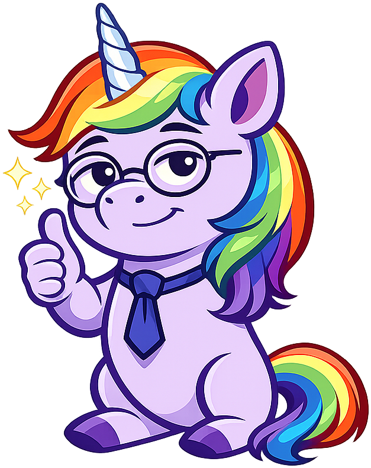
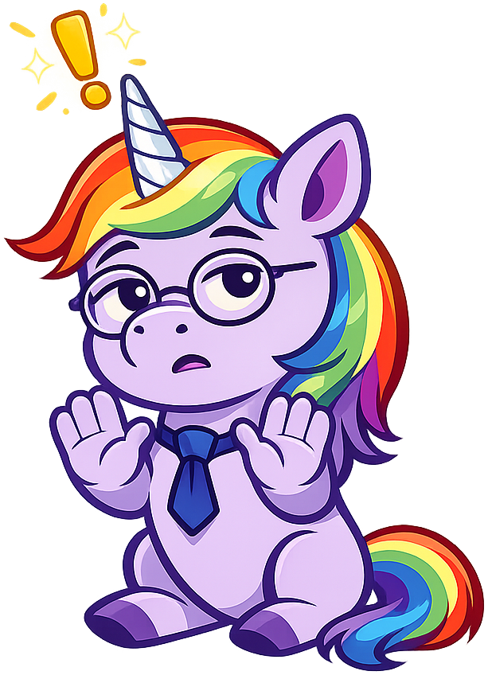
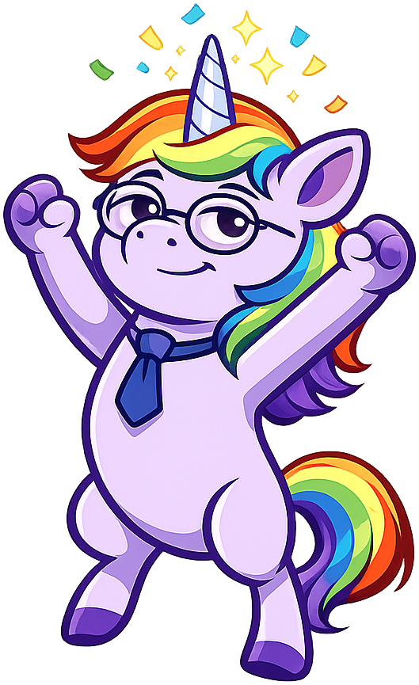

# Unicorns

**Sparkle the Unicorn** is the mascot for the [Unicorns and Other Mythical Beasts](https://dmccreary.github.io/unicorns/) textbook. Sparkle was chosen because the textbook is *about* unicorns and mythical beasts, which makes the mascot choice exceptionally direct: the character is a working example of the subject matter, not a metaphor for it. The choice is strong precisely because the literalness frees the mascot from the usual symbolic load — Sparkle does not need to encode an abstract disciplinary virtue, only to be a charming and consistent example of the creatures the book studies. For young readers especially, this directness is a feature: the mascot is self-evidently a member of the world the book describes, which builds engagement without any additional cognitive overhead.

All poses for the **Unicorns** mascot.

-   { width=300 }

    **Neutral**

-   { width=300 }

    **Welcome**

-   { width=300 }

    **Tip**

-   { width=300 }

    **Thinking**

-   { width=300 }

    **Encouragement**

-   { width=300 }

    **Warning**

-   { width=300 }

    **Celebration**

[← Back to gallery](../../list-mascots.md)
