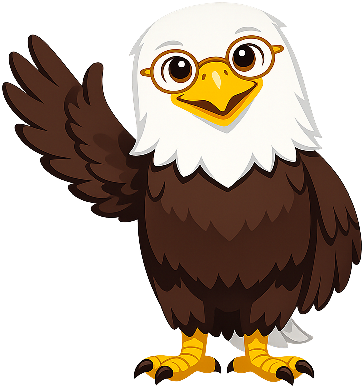
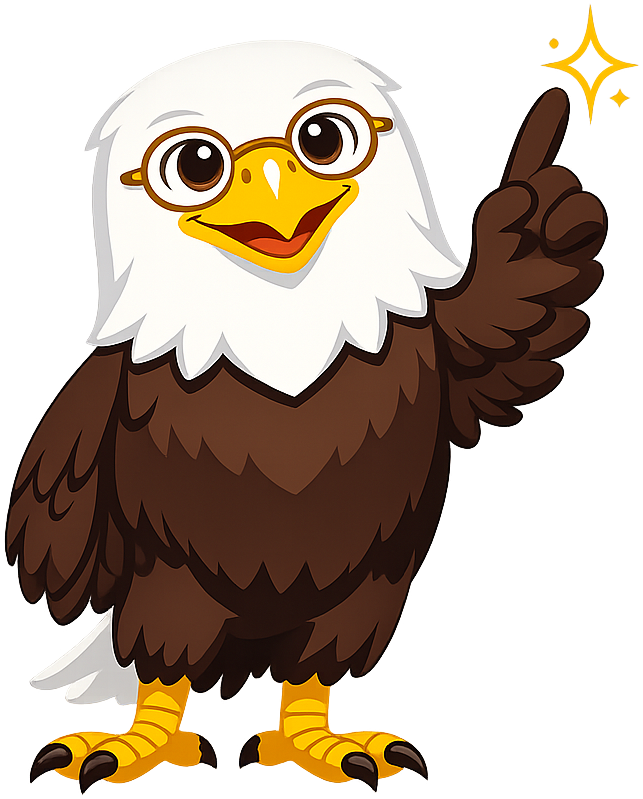

# U.S. Government

**Lex the Bald Eagle** is the mascot for the [US Government](https://dmccreary.github.io/us-government/) textbook. The bald eagle has been the official emblem of the United States since 1782, appearing on the Great Seal, the currency, presidential flags, and federal letterheads, which makes it the single most recognizable icon a student will encounter when reading about American institutions. The name *Lex* is the Latin word for "law" — the root of *legal*, *legislature*, *legitimate*, and *legislation* — so the character carries the two most fundamental ideas in the discipline simultaneously in his species and his name: the polity (the eagle) and the rule of law (Lex). Lex was chosen to make the textbook's two organizing concepts visually and verbally inseparable, so that a learner who can name the mascot has already named the subject matter. The choice is exceptional because the combination is over-determined — every viewer recognizes the eagle without instruction, and every Latin or legal-vocabulary cue in the curriculum silently reinforces the name.

All poses for the **U.S. Government** mascot.

-   { width=300 }

    **Neutral**

-   { width=300 }

    **Welcome**

-   { width=300 }

    **Tip**

-   { width=300 }

    **Thinking**

-   { width=300 }

    **Encouraging**

-   { width=300 }

    **Warning**

-   { width=300 }

    **Celebration**

[← Back to gallery](../../list-mascots.md)
