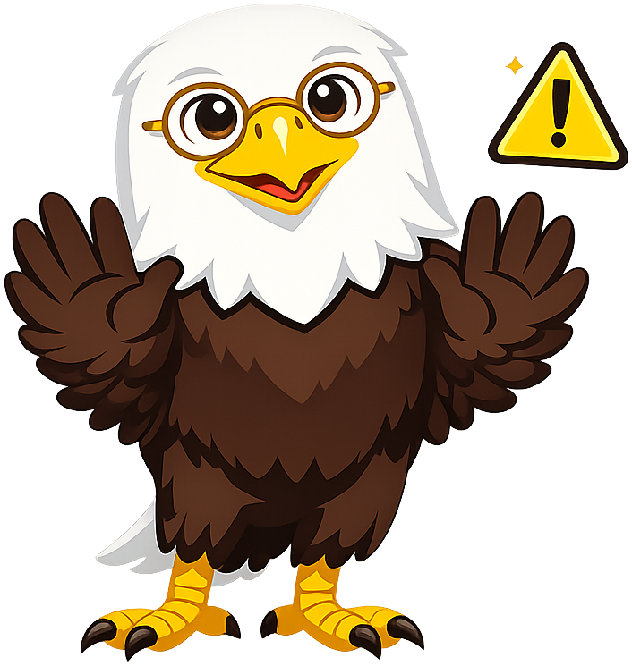

# U.S. History

**Liberty the Bald Eagle** is the mascot for the [U.S. History](https://dmccreary.github.io/us-history/) textbook. The bald eagle has served as the national emblem since 1782 and appears on the Great Seal, the regimental standards carried by American units since the Civil War, and the currency a student handles every day, making it the visual through-line of the country's recorded history. The name *Liberty* names the central organizing concept of the curriculum, so that every chapter examining the expansion, contraction, betrayal, or defense of liberty is implicitly a chapter about the mascot. Liberty was chosen so that the most important interpretive question in U.S. History — *who counted as free, and when?* — sits in the reader's mind from the first page, attached to a familiar face rather than to abstract terminology. The choice is exceptional because species and name each carry standalone weight, and together they pair naturally with [[us-government]]'s Lex the Bald Eagle to mark the two halves of the American studies sequence — narrative on one side, institutions on the other.

All poses for the **U.S. History** mascot.

-   { width=300 }

    **Neutral**

-   { width=300 }

    **Welcome**

-   { width=300 }

    **Tip**

-   { width=300 }

    **Thinking**

-   { width=300 }

    **Encouraging**

-   { width=300 }

    **Warning**

-   { width=300 }

    **Celebration**

[← Back to gallery](../../list-mascots.md)
