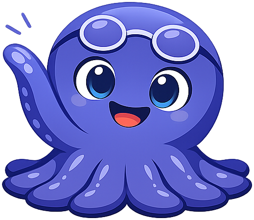
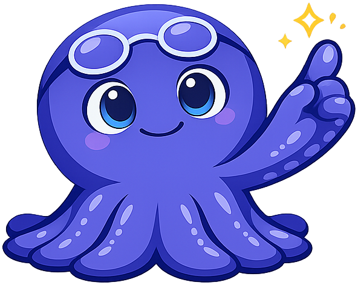
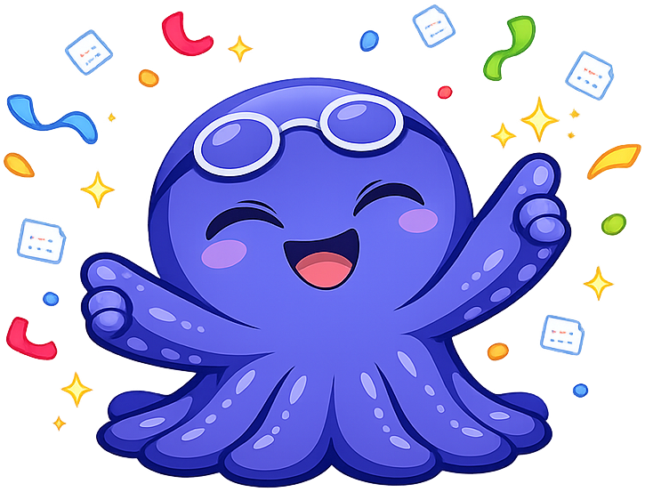

# xAPI Course

**Xavi the Octopus** is the mascot for the [xAPI for Intelligent Textbooks](https://dmccreary.github.io/xapi-course/) textbook. Octopuses run a famously distributed nervous system — most of their neurons live in their arms, each of which can sense, decide, and act semi-independently — which mirrors how the Experience API collects learning telemetry: actor-verb-object statements arrive from many independent activity sources and are stitched together into a coherent record of the learner. The name *Xavi* keeps the letter *x* — the literal first character of *xAPI* — at the front of the mascot's identity, so that a learner cannot say the mascot's name without already saying half the acronym. Xavi was chosen to install the intuition that learning analytics is a many-arms-at-once activity rather than a single linear log, and that the central record of learning lives in a Learning Record Store rather than inside any one application. The choice is strong because both name and species carry load-bearing meaning — the *x* of the API and the distributed cognition of the cephalopod — and Xavi pairs naturally with [[bioinformatics]]'s Olli the Octopus as a second cephalopod modeling parallel-streams thinking in a different discipline.

All poses for the **xAPI Course** mascot.

-   { width=300 }

    **Neutral**

-   { width=300 }

    **Welcome**

-   { width=300 }

    **Tip**

-   { width=300 }

    **Thinking**

-   { width=300 }

    **Encouraging**

-   { width=300 }

    **Warning**

-   { width=300 }

    **Celebration**

[← Back to gallery](../../list-mascots.md)
