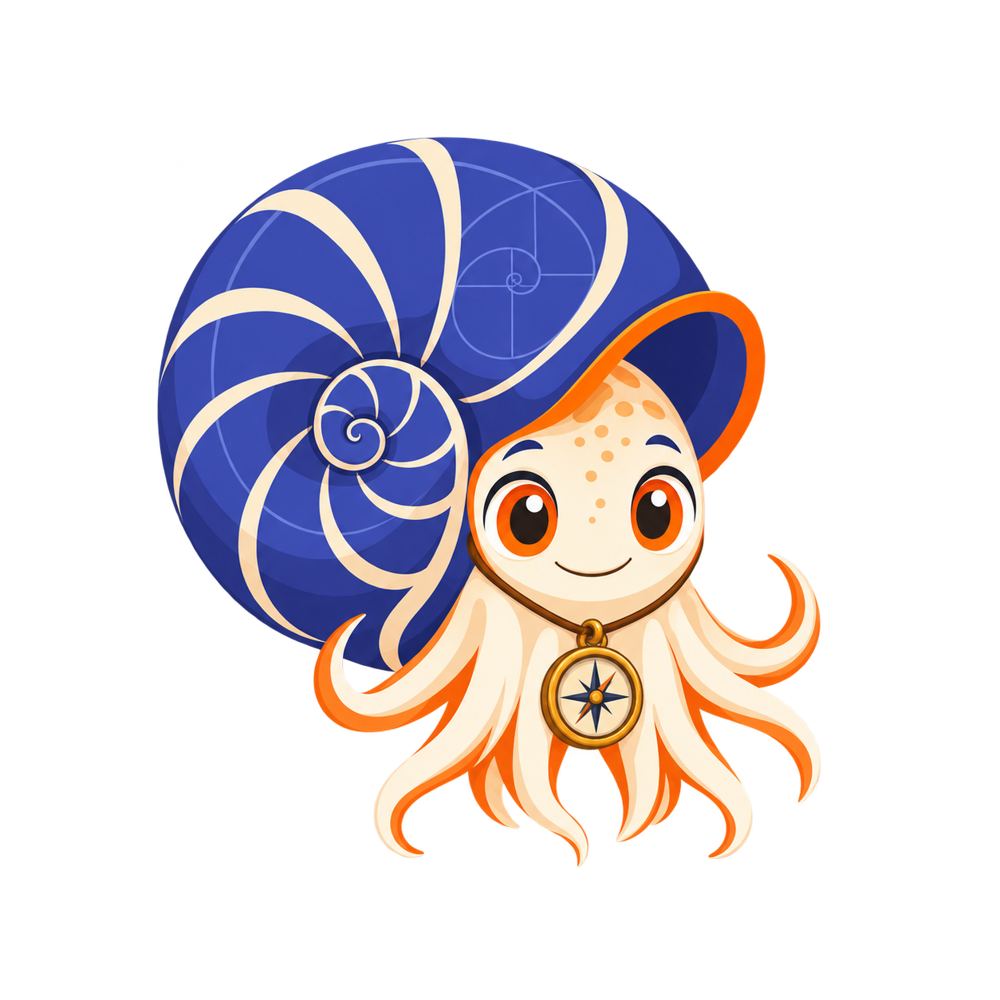
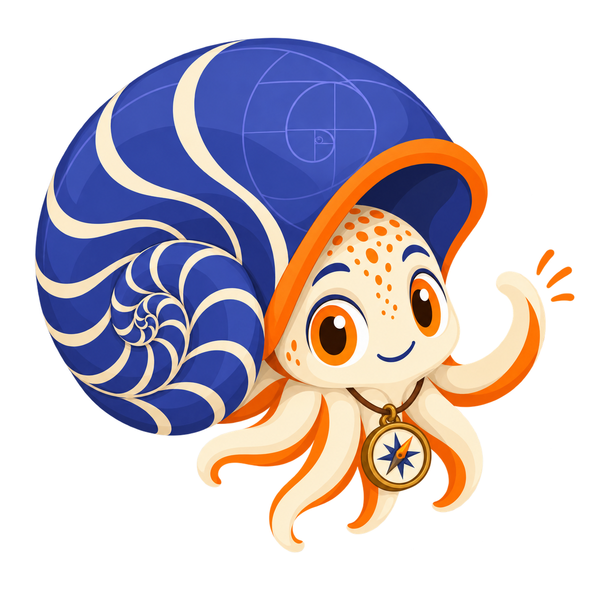
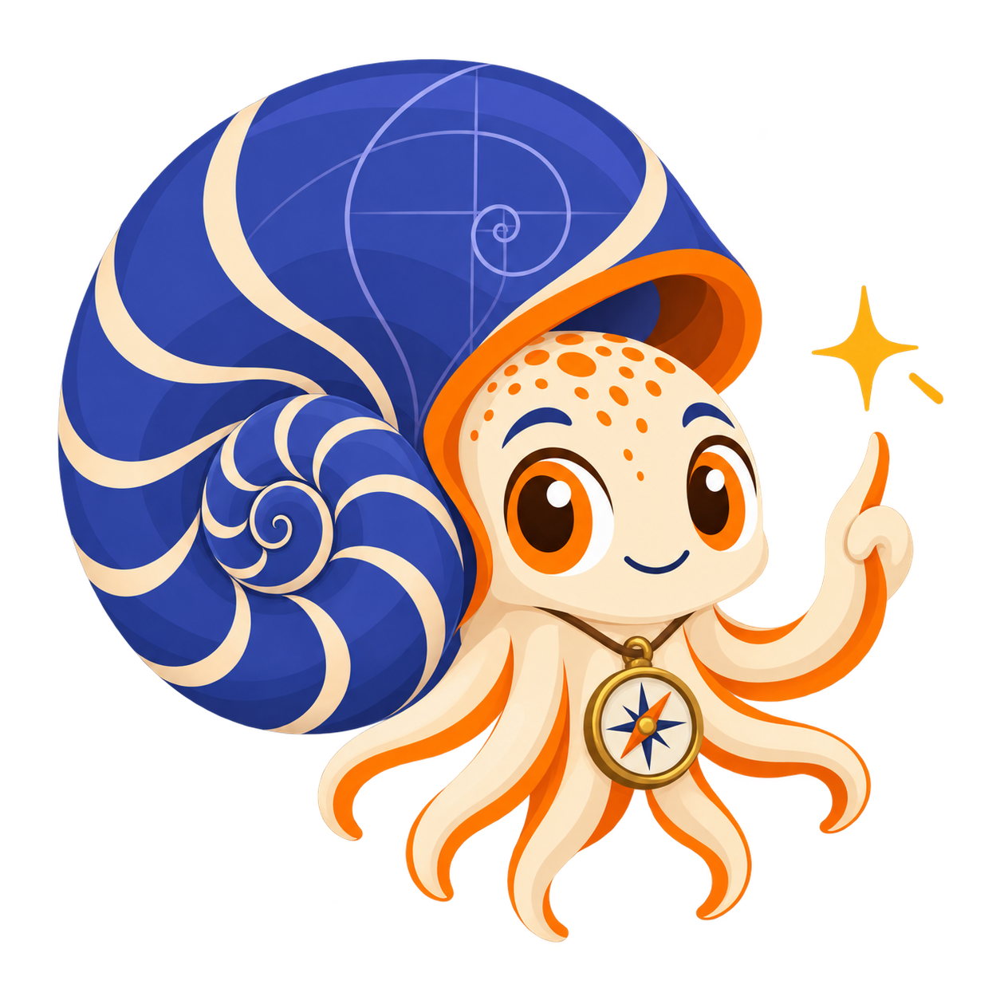
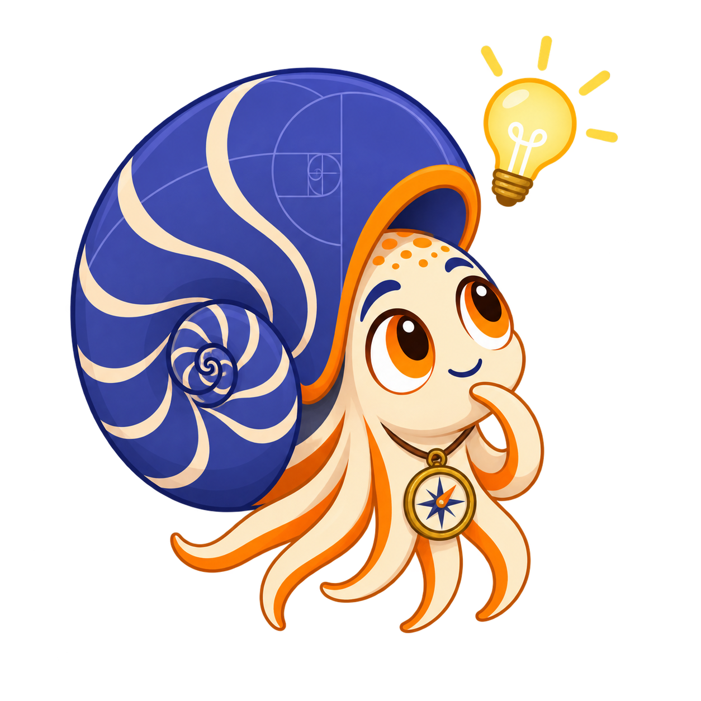
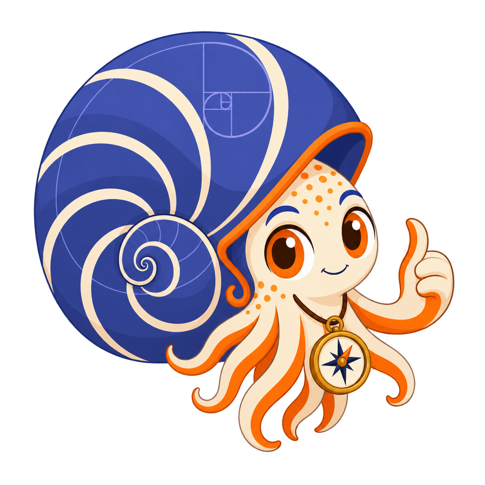
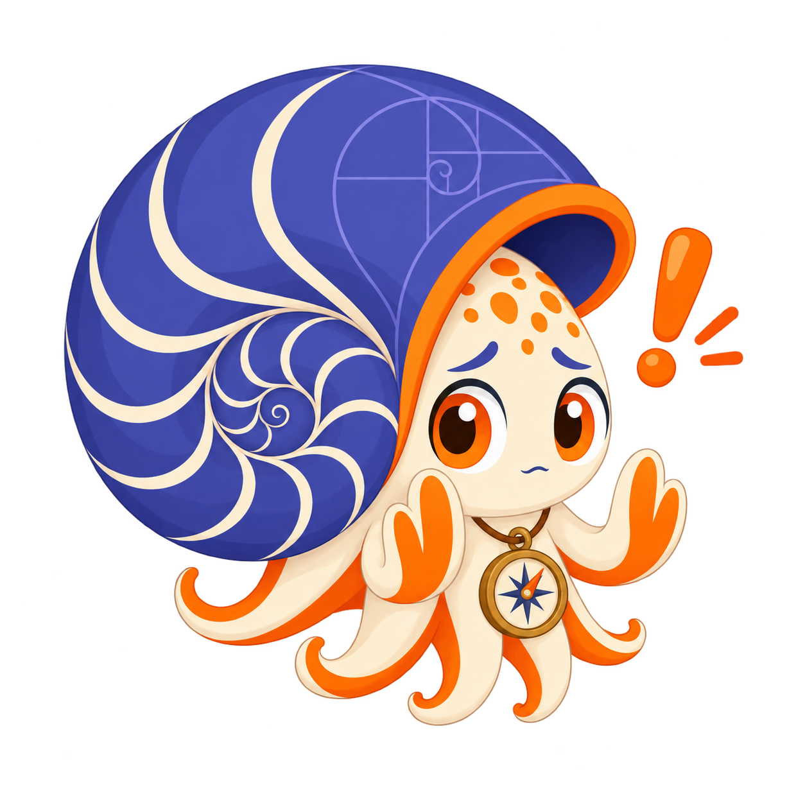
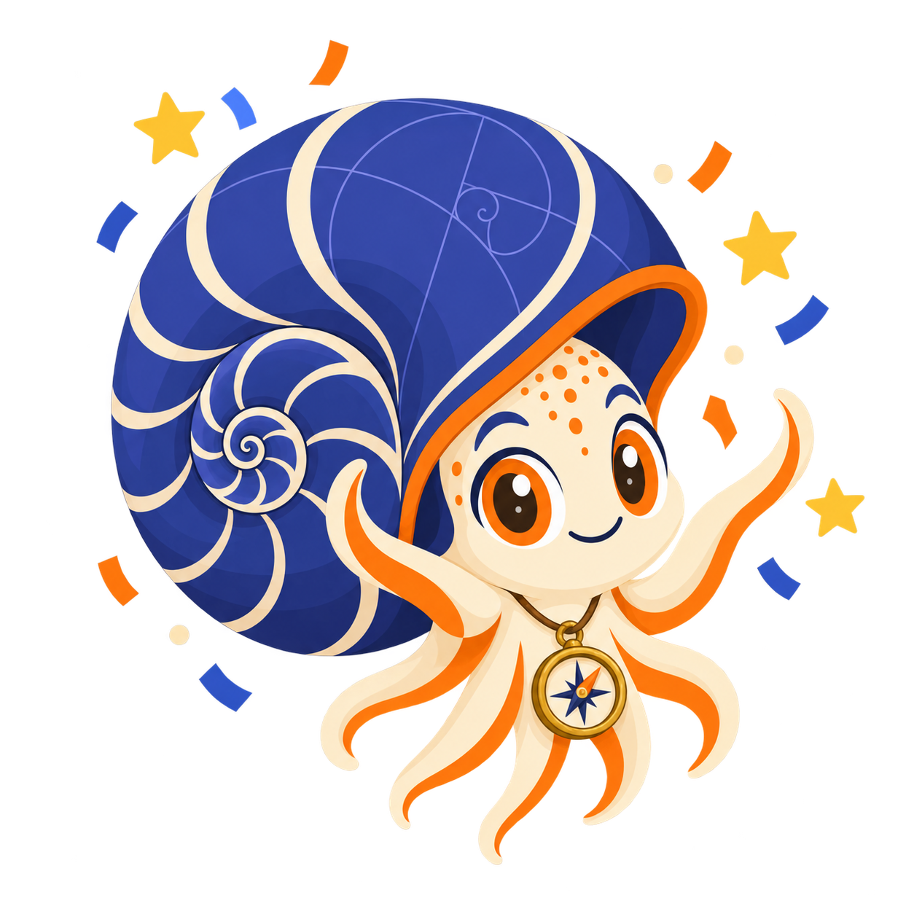

# Zensical Test

**Nova the Nautilus** is the mascot for [Migrating from MkDocs to Zensical](https://dmccreary.github.io/zensical-test/), a guide to moving a documentation site from MkDocs Material to the Zensical static site generator. A chambered nautilus grows by adding one larger chamber at a time along a logarithmic spiral, sealing off each finished chamber before starting the next — a close biological match for a migration guide's central discipline of moving one self-contained piece of a site at a time rather than attempting it all at once. The name Nova ("new") signals the destination platform without naming it outright, and the character's small brass compass reinforces the idea of deliberately charting a course rather than migrating haphazardly. Nova was chosen so the mascot's own body — chamber after chamber, never rushed — models the exact discipline the book asks of its reader. That structural match between species and subject puts Nova among the gallery's strongest mascots.

All poses for the **Zensical Test** mascot.

-   { width=300 }

    **Neutral**

-   { width=300 }

    **Welcome**

-   { width=300 }

    **Tip**

-   { width=300 }

    **Thinking**

-   { width=300 }

    **Encouraging**

-   { width=300 }

    **Warning**

-   { width=300 }

    **Celebration**

[← Back to gallery](../../list-mascots.md)
